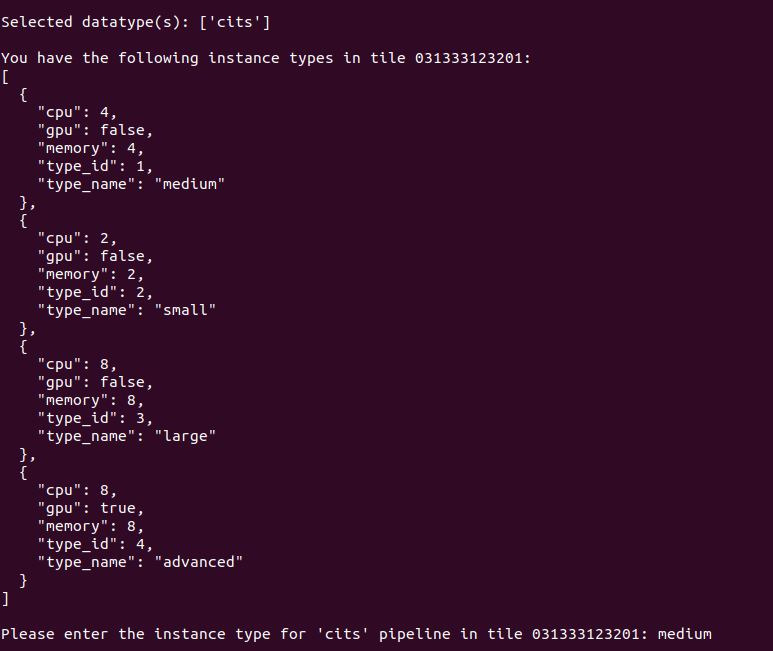
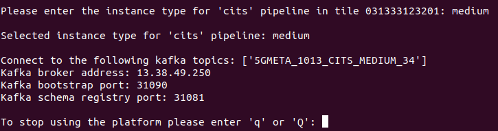

# 5GMETA Third Parties

## Introduction

5GMETA platform is an IoT oriented platform that produces data from vehicles to be consumed by third party applications in order to get data from several types:

* CITS
    * json like messages with data extracted from the vehicle (ex: GPS position, etc)
    * [Example](https://github.com/5gmeta/5gmeta-dev/tree/main/tools/cits-example.json)
* images
    * jpg
* Video streaming


## Prerequisities for interfacing a 3rd-party application with the Platform

## 5GMETA platform access

3rd-party application developpers need to have access to a running instance of the 5GMETA platform.
During the 5GMETA project lifetime, 5GMETA platform can is available at [http://5gmeta-platform.eu](http://5gmeta-platform.eu/).

If you want to be granted an access, please contact a platform administrator.

## Software requirements

* Ubuntu, preferrably 20.04
* python3
* python3-avro
* python3-confluent-kafka
* gstreamer1.0-plugins-bad (only if you are going to consume video)
* gstreamer1.0-libav (only if you are going to consume video)
* python3-gst-1.0 (only if you are going to consume video)


### PIP packages to install

* kafka-python
* numpy
* python-qpid-proton
* requests
* confluent-kafka (at least version 2.0.2)
* avro
* avro-python3
* fastavro
* avro_to_python

Also find easy installation for all the required packages(Be careful of your environment compatibility):

* ```pip3 install -r examples/stream-data-gateway/requirements.txt```


## Software requirements

This guide is oriented to be executed in an Ubuntu 20.04 environment.

## Extra packages to be installed
First of all, you will need to install some dependencies (apt-get):

* python3-avro
* python3-confluent-kafka
* gstreamer1.0-plugins-bad (only if you are going to consume video)
* gstreamer1.0-libav (only if you are going to consume video)
* python3-gst-1.0 (only if you are going to consume video)
* ```sudo apt-get install python3-avro python3-confluent-kafka gstreamer1.0-plugins-bad gstreamer1.0-libav python3-gst-1.0```

Also install with pip3:

* kafka-python
* numpy
* python-qpid-proton
* requests
* confluent-kafka
* avro

Note : Be careful of your environment compatibility:

* ```pip3 install -r examples/stream-data-gateway/requirements.txt```
* Link for [examples/stream-data-gateway/requirements.txt](https://github.com/5gmeta/5gmeta-dev/blob/main/examples/stream-data-gateway/requirements.txt)


## Platform-client helper application

There is a guided applicaction that will help you to get the apropriate parameters from 5GMETA platform to get the data you need.
You can execute it by downloading all content from folder: 

* [Platform client helper application](https://github.com/5gmeta/5gmeta-dev/tree/main/utils/platform-client/client.py)

Once you have donwload that software you can run it by executing:
```
$ python3 client.py
```

in your command line.


### Client usage

Once you have executed the previous command you will be prompted for:

* 5GMETA username
* 5GMETA password
 
These credentials will be valid if you have registered to 5GMETA platform offered by the [Identity](https://github.com/5gmeta/identity) building block.
During 5GMETA project, registration can be done at this [Registration web page](https://5gmeta-platform.eu/identity/realms/5gmeta/login-actions/registration?client_id=apisix&tab_id=gXKk2YPUybg).


After entering your username/password, client will ask you if you want to:
* Consume data from 5GMETA platform
* Produce an event in a vehicle connected to 5GMETA platform


In our case we have decided to consume data, so we push c. 

Inmediately client will show which [tile](#tile) have data.


And will ask you to select one of them to consume data from.


You can stop selecting tiles by pushing q in your keyboard.

After selecting tiles client will show which datatype is available in the tiles you have selected.


And will ask you to select which datatype do you want to consume.


Once selected you will be prompted with the instancetype you can use in the MEC that is managin data from that tile



and will be asked to choose one.

Once selected you will be prompted with the parameters from 5GMETA platform you have to use in consumer examples




Please notice that the parameters showed in that ouput **ARE VALID ONLY IF YOU KEEP client.py RUNNING**, once you stop it by pressing **q** those parameters could not be valid for your consumer application.

**PLEASE DON'T STOP client.py APPLICATION BY PUSHING CTRL-C**


## Consumer examples

5GMETA platform offers some examples to comsume those data.

* [CITS command line consumer](https://github.com/5gmeta/5gmeta-dev/tree/main/examples/stream-data-gateway/consumer/cits/cits-consumer.py)
* [image command line consumer](https://github.com/5gmeta/5gmeta-dev/tree/main/examples/stream-data-gateway/consumer/image/image-consumer.py)
* [video command line consumer](https://github.com/5gmeta/5gmeta-dev/tree/main/examples/stream-data-gateway/consumer/video/video-consumer.py)

Those consumer clients will ask you for the parameters obtained as output in the [Client usage](#client-usage) section.

### CITS consumer

This client is a Kafka client that will consume CITS data from 5GMETA platform and will print on the command line output. It takes as input parameters:

* Kafka topic
* Kafka broker address
* Kafka bootstrap port
* Kafka schema registry port

### IMAGE consumer

This client is a Kafka client that will consume images data from 5GMETA platform and will print on the command line output. It takes as input parameters:

* Kafka topic
* Kafka broker address
* Kafka bootstrap port
* Kafka schema registry port

#### Consumer instructions

- Select the suitable consumer as per the produced data and use as follows: 
```
python3 cits-consumer.py topic platformaddress bootstrap_port registry_port

``` 
or
```
mkdir output
python3 image-consumer.py topic platformaddress bootstrap_port registry_port

``` 
or

```
python3 video-consumer.py platformaddress bootstrap_port topic dataflow_id

```

## Credits

This documentation was originally written by:

- Mikel Serón Esnal (mseron@vicomtech.org, GitHub)


## Conclusions and Perspectives
